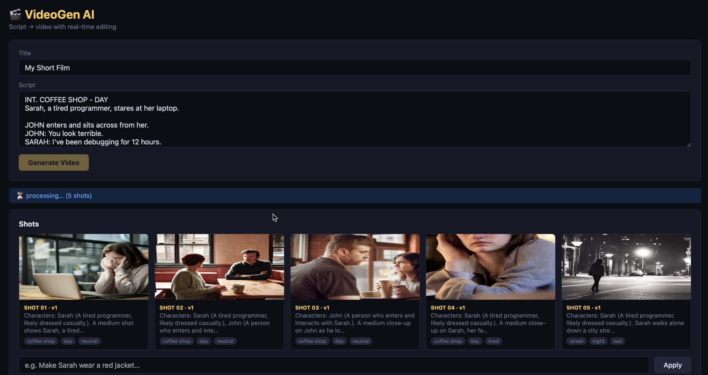
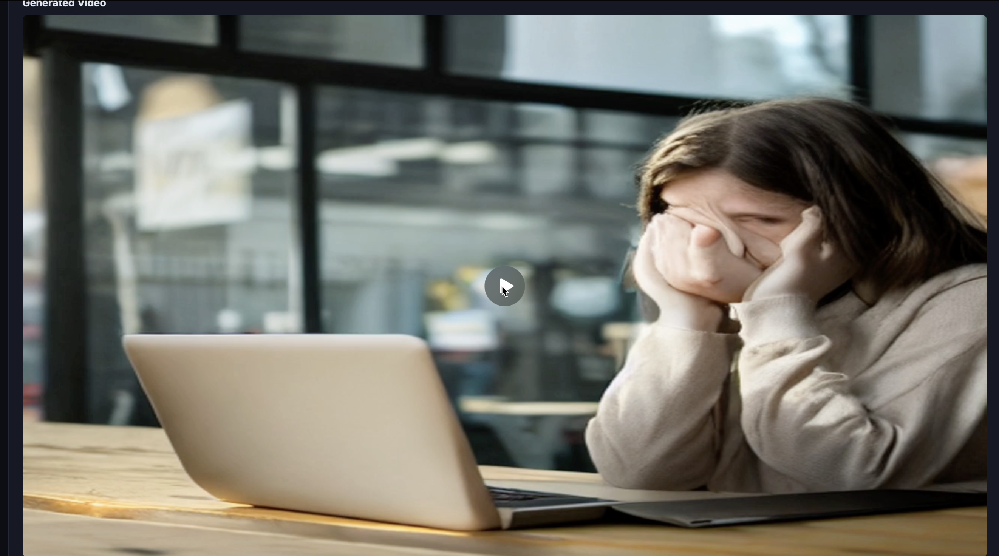

# 🎬 StateAware Incremental Video Generator

> An agentic AI system that converts a plain film script into a video — and lets you change anything in real-time. Say *"Make Sarah wear a red jacket"* and only the affected shots regenerate. Everything else stays untouched.

Built as a technical assessment for the **Eskillveda Summer Internship Program 2026**.

---

## 🧩 What Is This?

Most video generation tools regenerate everything from scratch when you make a change. This system is different.

It tracks the **state of every shot** in your script. When you give feedback, it figures out exactly which shots are affected, regenerates only those, and rebuilds the video — preserving the rest. Characters look consistent across shots because their appearance is injected into every image prompt automatically.

The result: a fully agentic, stateful, incremental video generation pipeline.

---

## 🛠️ Tech Stack

| Tool | Purpose | Why We Chose It |
|---|---|---|
| **Gemini 2.5 Flash** | Script parsing + feedback analysis | Fast, accurate, handles complex JSON outputs reliably |
| **Stable Diffusion v1.5** | AI image generation (runs locally) | Fully free, no API limits, no network dependency |
| **MoviePy** | Stitching images into MP4 + audio | Simple Python-native video library |
| **Flask** | REST API backend | Lightweight, minimal boilerplate |
| **SQLite** | Shot state + version tracking | Zero setup, persistent across runs |
| **HuggingFace Diffusers** | Stable Diffusion pipeline wrapper | Clean API for local model inference |

---

## 🏗️ Architecture — 4 Agents

Every agent has one job and one job only.

```
┌─────────────────────────────────────────────────────────┐
│                      USER INPUT                         │
│              (script text in browser)                   │
└─────────────────────┬───────────────────────────────────┘
                      │
                      ▼
┌─────────────────────────────────────────────────────────┐
│  SCRIPT AGENT  (Gemini 2.5 Flash)                       │
│  Reads the raw script                                   │
│  → Breaks it into shots (description, location,        │
│    time of day, mood, characters)                       │
│  → Extracts all named characters + their appearance    │
└─────────────────────┬───────────────────────────────────┘
                      │
                      ▼
┌─────────────────────────────────────────────────────────┐
│  STATE AGENT                                            │
│  Takes character appearance descriptions                │
│  → Prepends them into every shot prompt                 │
│  → Ensures visual consistency across all shots         │
│    e.g. "Sarah (tired programmer, red hoodie). A        │
│    medium shot of Sarah staring at her laptop..."       │
└─────────────────────┬───────────────────────────────────┘
                      │
                      ▼
┌─────────────────────────────────────────────────────────┐
│  IMAGE GENERATION  (Stable Diffusion v1.5 — local)      │
│  For each shot:                                         │
│  → Builds a cinematic prompt with mood + location       │
│  → Generates a 1280×720 photorealistic image            │
│  → Saves to disk, stores path in SQLite                 │
│  → Falls back to styled placeholder if model errors     │
└─────────────────────┬───────────────────────────────────┘
                      │
                      ▼
┌─────────────────────────────────────────────────────────┐
│  VIDEO AGENT  (MoviePy)                                 │
│  → Stitches all shot images into a video (3s per shot)  │
│  → Loops background music over the full duration        │
│  → Exports final MP4                                    │
└─────────────────────┬───────────────────────────────────┘
                      │
                      ▼
┌─────────────────────────────────────────────────────────┐
│  USER GIVES FEEDBACK                                    │
│  e.g. "Make Sarah wear a red jacket"                    │
└─────────────────────┬───────────────────────────────────┘
                      │
                      ▼
┌─────────────────────────────────────────────────────────┐
│  FEEDBACK AGENT  (Gemini 2.5 Flash)                     │
│  → Reads all shot descriptions                          │
│  → Identifies which shots are affected                  │
│  → Returns updated descriptions for those shots only   │
└─────────────────────┬───────────────────────────────────┘
                      │
                      ▼
┌─────────────────────────────────────────────────────────┐
│  INCREMENTAL REGENERATION                               │
│  → Only dirty shots get new images (version bumped)     │
│  → Clean shots reuse cached images                      │
│  → Video rebuilds with mix of old + new shots           │
│  → Background music preserved                          │
└─────────────────────────────────────────────────────────┘
```

---

## 📁 Project Structure

```
video_gen/
├── app.py                  # Flask routes + pipeline runner
├── config.py               # Config, DB schema, constants
├── agents/
│   └── agents.py           # All 4 agents in one file
├── services/
│   └── helpers.py          # Stable Diffusion image gen + DB helpers + Gemini calls
├── templates/
│   └── index.html          # Single-page UI
├── outputs/                # Generated images + final MP4
├── .env                    # Your API key (not committed)
├── requirements.txt
└── README.md
```

---

## ⚙️ Setup — Step by Step

### 1. Clone the repository
```bash
git clone https://github.com/Ppp3338888/script-video.git
cd script-video/video_gen
```

### 2. Create and activate virtual environment
```bash
python -m venv venv

# Mac/Linux:
source venv/bin/activate

# Windows:
venv\Scripts\activate
```

### 3. Install dependencies
```bash
pip install -r requirements.txt
```
> ⚠️ First run will download Stable Diffusion v1.5 (~5.5GB). This happens automatically.

### 4. Add your Gemini API key
Create a `.env` file in the `video_gen/` folder:
```
GEMINI_API_KEY=your_gemini_api_key_here
```
Get a free key at `https://aistudio.google.com`

### 5. Run the app
```bash
python app.py
```

Open `http://localhost:5000` in your browser.

---

## 🎮 How to Use

**Generate a video:**
1. Paste your film script in the text box
2. Click **Generate Video**
3. Wait — Gemini parses shots, Stable Diffusion generates images, MoviePy builds the video
4. Each shot image appears as it's generated

**Apply feedback:**
1. Once video is ready, type a change in the feedback box
   - e.g. `Make Sarah wear a red jacket`
   - e.g. `Change the coffee shop to a rooftop at night`
2. Click **Apply**
3. Only the affected shots regenerate — everything else stays the same

---

## 📸 Screenshots

### Shot generation in progress


### Feedback applied — only affected shots regenerated


---

## 🔌 API Reference

| Endpoint | Method | Body | Response |
|---|---|---|---|
| `/api/generate` | POST | `{"title": "...", "script": "..."}` | `{"project_id": "...", "status": "processing"}` |
| `/api/project/<pid>` | GET | — | project + shots + video_url |
| `/api/feedback/<pid>` | POST | `{"feedback": "..."}` | `{"affected_shots": [...], "video_url": "..."}` |
| `/api/video/<pid>` | GET | — | MP4 stream |
| `/api/img/<filename>` | GET | — | PNG image |

---

## 💡 Key Design Decisions

**Incremental regeneration over full rebuild**
Each shot has a `dirty` flag and a `version` counter in SQLite. When feedback comes in, only flagged shots get new images. This avoids regenerating 10+ minute pipelines for a single costume change.

**Local image generation**
Stable Diffusion v1.5 runs entirely on your machine via HuggingFace diffusers. No paid API, no rate limits, no network dependency after the initial model download.

**Character state continuity**
The StateAgent prepends each character's appearance description into their shot prompts. This keeps Sarah looking like Sarah across 10 different shots without any extra logic.

**Single-file agents**
All 4 agents live in `agents/agents.py` as plain functions. No LangChain, no AutoGen, no unnecessary abstraction. Easy to read, easy to modify, easy to explain in an interview.

**Model loaded once**
The Stable Diffusion pipeline is loaded into memory once and reused for all shots. This avoids the 30-second model reload penalty on every single image.